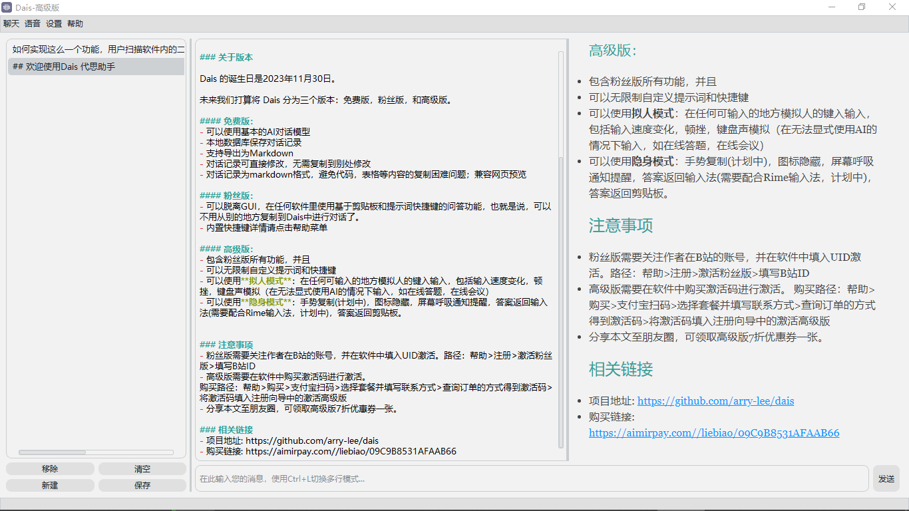

## 欢迎使用 Dais 代思助手

Dais 是一个专注于提高效率的大语言模型电脑客户端，让大语言模型的使用更人性化。
Dais 不生产大模型，Dais 只是大模型的搬运工。

### 关于 Dais
- Dais 英文中的意思是讲台，或者稍微突出于地面的台子。我们希望 Dais 能让你站的比周围的人高一点。

- Dais 的中文名叫“代思”，类比"代笔"，"代练"，不难理解”代思“的含义就是可以帮助您思考一些问题。

- Dais 的人格化名字计划叫 “黛思”，在未来，接入更强大的语音合成系统，是计划的一部分。

### 关于版本

Dais 的诞生日是2023年11月30日。

未来我们打算将 Dais 分为三个版本：免费版，粉丝版，和高级版。

#### 免费版 Free：
- 可以使用基本的AI对话模型
- 本地数据库保存对话记录
- 支持导出为 markdown
- 对话记录可直接编辑，无需复制到别处修改
- 对话记录为 markdown 格式，同时兼容网页预览。（避免代码和表格等内容的复制格式混乱问题）

#### 粉丝版 Fans：
- 可以脱离GUI，使用基于剪贴板和快捷键的问答功能，再也不用从别的地方复制到AI对话框中进行对话，随时随地，畅快问答
- 问答完成有语音消息提示
- 多种内置提示词快捷键映射，满足日常工作使用要求
  - 翻译：CTRL+ALT+T: 请将下面这段话翻译成中文，不需要做任何解释:
  - 问答：CTRL+ALT+Q: 请从专业的角度回答下面的问题:
  - 编程：CTRL+ALT+P: 请用PYTHON帮我解决下面这个问题，只需要返回代码即可，不需要任何其他解释:
  - DEBUG：CTRL+ALT+D: 请解决下面这个报错:
  - 解释：CTRL+ALT+E: 请解释下面这段文字:
  - 总结：CTRL+ALT+Z: 请总结下面这段文字:

#### 高级版 Pro：
- 包含粉丝版所有功能，并且
- 可以无限制自定义提示词和快捷键
- **隐身模式**：
  - 后台运行，图标隐藏
  - 屏幕呼吸，通知提醒
  - 答案返回剪贴板，随时粘贴
  - 手势复制(计划中)，
  - 答案返回输入法(需要配合Rime输入法，计划中)
  
- **拟人模式**：
  - 在任何可输入的地方模拟人的键入输入，包括输入速度变化，顿挫，
  - 键盘声模拟
  - 使用场景：在无法显式使用AI的情况下输入，如在线答题，在线会议等

- 具体操作方式：
  0. 在任何地方选中要提问的内容，使用 Ctrl+C 复制到剪贴板
  1. 再按下对应的快捷键，比如 Ctrl+ALT+P，写代码
  2. 等待对话完成，会有音效提示，或者屏幕亮度轻微闪烁5次，说明答案完成
  3. 使用Ctrl+V 在任何地方粘贴，或者使用 CTRL+ALT+V 实现拟人键入
  4. 中途可按 Esc 键停止，再按下CTRL+ALT+V继续接着停下的地方键入
  5. 如果需要放弃当前对话，需要按下CTRL+ALT+N清理掉上次对话的键入缓存
  
## 定价

1. 按年结算：280/年
2. 按半年结算：150/半年
3. 按月结算：28/月

### 购买方式

1. 自助购买链接: [Dais激活码商店](https://aimirpay.com//liebiao/09C9B8531AFAAB66)，注意填写联系方式，可通过联系方式查询订单。
2. 微信或支付宝转账并备注邮箱，收到款项之后会通过邮箱发送激活码，有延迟。

### 注意事项
- 粉丝版需要关注作者在B站的账号[讨土](https://space.bilibili.com/263505688)，并在软件中填入你的UID进行激活粉丝版。
  - 激活路径：帮助 > 注册 > 激活粉丝版 > 填写B站ID
- 高级版需要在软件中购买激活码进行激活。
  - 购买路径：帮助 > 购买 > 支付宝扫码 > 选择套餐并填写联系方式 > 查询订单的方式得到激活码
  - 激活路径：帮助 > 注册 > 激活高级版 > 填写激活码和~~用户名<不重要>~~

## 相关链接
- 项目地址: [https://pyrj.com/dais](https://pyrj.com/dais)
- 下载链接: [https://pyrj.com/dais/download](https://github.com/arry-lee/dais/releases/download/v0.6.0-beta/dais_v0.6.0-beta.zip)
- 备用网盘链接:[https://pan.baidu.com/s/1V2--s4y8mTx91JFwDbDNtQ?pwd=6c43](https://pan.baidu.com/s/1V2--s4y8mTx91JFwDbDNtQ?pwd=6c43)
- 问题反馈群: 781924331
